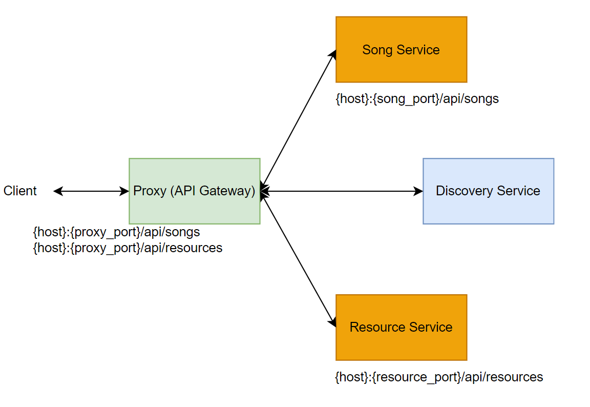

# SD-cloud-gateway-service

This service crates API Gateway as a single entry point for [Resource](https://github.com/LizaSamodumkina/MAO-resource-service) 
and [Song](https://github.com/LizaSamodumkina/MAO-song-service) microservices.

High-level overview of the system:

Name of the service is _proxy_. Property configurations to define routes are described in [application.yml](src%2Fmain%2Fresources%2Fapplication.yml)

## Other components:
1. [Discovery Service](https://github.com/LizaSamodumkina/SD-eureka-discovery-service)
2. [Song Service](https://github.com/LizaSamodumkina/MAO-song-service)
3. [Resource Service](https://github.com/LizaSamodumkina/MAO-resource-service)
